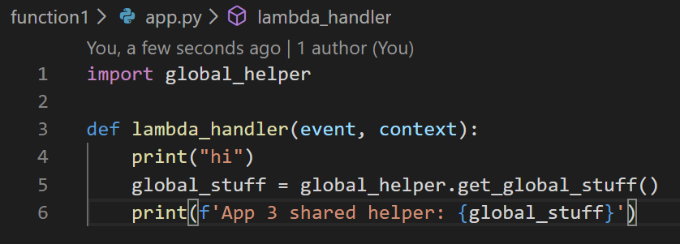

This project contains a bare bones AWS SAM Lambda application to determine the correct configuration for debugging in VS Code

There is supposed to be CodeLens links above the `lambda_handler` method in `app.py` but they don't appear for me.

